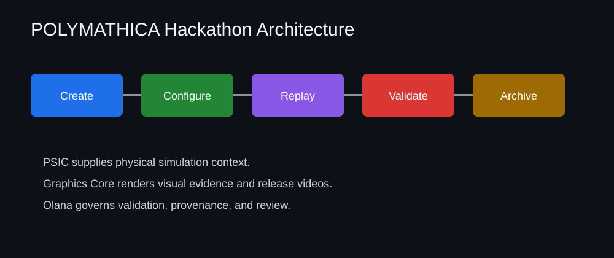

# Architecture

POLYMATHICA is presented here as a compact judged workflow, not the full research workspace.

```text
Create
  -> Configure
  -> Run or Replay
  -> Validate
  -> Visualise
  -> Report
  -> Archive
```

## Systems

- POLYMATHICA: experiment orchestration, execution state, evidence lifecycle and institute interface.
- PSIC: scientific reasoning, planning, validation interpretation and research coordination.
- Graphics Core: scientific rendering, replay and media evidence generation.
- Olana: scientific oversight, contradiction analysis, governance review and experiment discussion.

## Demonstration Boundary

The hackathon repository includes one complete deterministic replay workflow in `src/polymathica_hackathon`. It is intentionally small, readable and testable, while the release assets and docs point to the larger local GPU-generated outputs.

This public package demonstrates orchestration and evidence governance. It does not publish the complete private solver, PSIC, Graphics Core or Olana development repositories.


