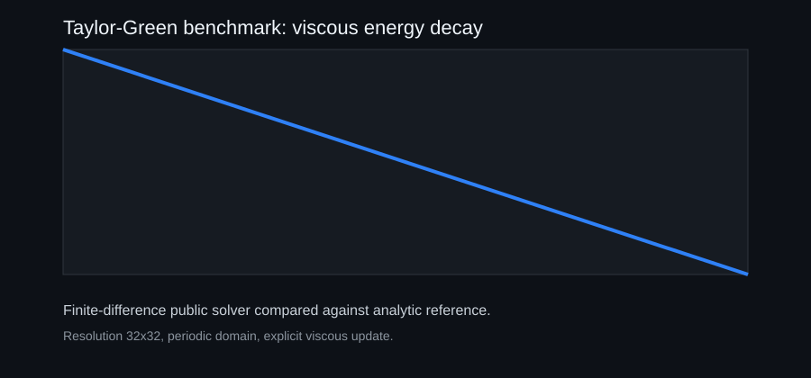

# Public Benchmark Solver

This repository includes one small benchmark-backed solver example:

**Taylor-Green vortex viscous decay**

The solver uses:

- a 32x32 periodic grid
- explicit finite-difference viscous update
- analytic Taylor-Green reference field
- L2 and max-error comparison at final time
- committed validation, report, trace and archive artifacts

Run it:

```bash
python -m polymathica_hackathon.benchmark --output demo/benchmark
python -m unittest discover -s tests
```

Generated artifacts:

- `demo/benchmark/benchmark_config.json`
- `demo/benchmark/energy_history.json`
- `demo/benchmark/benchmark_validation.json`
- `demo/benchmark/benchmark_trace.svg`
- `demo/benchmark/benchmark_report.html`
- `demo/benchmark/benchmark_manifest.json`

## Scope

This is not the full private POLYMATHICA solver stack. It is a public, modest-resolution benchmark designed to prove that the submission contains a real executable numerical solver path with a documented reference comparison.


