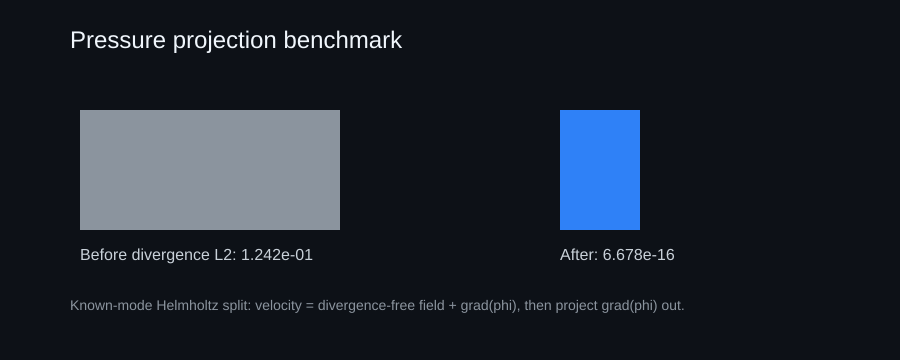

# Public Pressure-Projection Benchmark

This repository includes a second independent public benchmark:

**Periodic pressure projection with a known Helmholtz split**

The benchmark starts with a divergence-free Taylor-Green velocity field, adds a known irrotational component `grad(phi)`, recovers that first-mode potential from the measured divergence, and projects it back out.

Current committed result:

| Metric | Value |
| --- | ---: |
| Divergence before L2 | `1.241984e-01` |
| Divergence after L2 | `6.678177e-16` |
| Projected-field L2 error | `5.770979e-17` |
| Potential L2 error | `4.311875e-17` |
| Irrotational energy removed | `7.812500e-03` |

Run it:

```bash
python -m polymathica_hackathon.projection --output demo/projection
python -m unittest discover -s tests
```

Generated artifacts:

- `demo/projection/projection_config.json`
- `demo/projection/projection_validation.json`
- `demo/projection/projection_manifest.json`
- `demo/projection/projection_trace.svg`
- `demo/projection/projection_report.html`

## What It Proves

- a public pressure/projection-style incompressibility correction
- divergence is reduced by a large factor
- the known irrotational component is recovered
- the projected field returns to the divergence-free reference field
- the projection removes the extra irrotational kinetic energy

## Scope

This is a known-mode projection benchmark, not a general-purpose pressure Poisson solver. It is included to make the public submission broader and more scientifically complete while remaining auditable in pure Python.


