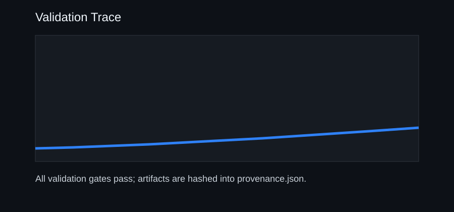

# Validation

The demonstration workflow generates four validation gates:

- initial energy matches the configured reference value
- divergence remains below a strict numerical bound
- kinetic energy remains positive
- the replay changes state under lid-driven forcing

The test suite also checks negative governance paths:

- invalid configurations are rejected
- public demo mode cannot be mislabeled as a live solver
- failed validation cannot produce an archive manifest
- artifact hash mismatches are detected
- missing artifacts are detected
- provenance schema contains the required lifecycle stages

Run locally:

```bash
python -m polymathica_hackathon.suite --output demo
python -m polymathica_hackathon.verify --root demo --report demo/verification_report.json
python -m unittest discover -s tests
```

Expanded component path:

```bash
python -m polymathica_hackathon.cli --output demo/output
python -m polymathica_hackathon.benchmark --output demo/benchmark
python -m polymathica_hackathon.projection --output demo/projection
python -m polymathica_hackathon.poiseuille --output demo/poiseuille
python -m unittest discover -s tests
```

Generated evidence:

- `demo/evidence_suite_summary.json`
- `demo/evidence_suite_manifest.json`
- `demo/verification_report.json`
- `demo/output/experiment_config.json`
- `demo/output/replay_samples.json`
- `demo/output/validation_report.json`
- `demo/output/validation_trace.svg`
- `demo/output/report.html`
- `demo/output/provenance.json`
- `demo/output/archive_manifest.json`

Benchmark evidence:

- `demo/benchmark/benchmark_config.json`
- `demo/benchmark/benchmark_validation.json`
- `demo/benchmark/convergence_study.json`
- `demo/benchmark/benchmark_manifest.json`

See [BENCHMARK.md](BENCHMARK.md) for the public solver reference comparison.

Projection evidence:

- `demo/projection/projection_config.json`
- `demo/projection/projection_validation.json`
- `demo/projection/projection_manifest.json`

See [PROJECTION.md](PROJECTION.md) for the public pressure-projection benchmark.

Poiseuille evidence:

- `demo/poiseuille/poiseuille_config.json`
- `demo/poiseuille/poiseuille_profile.json`
- `demo/poiseuille/poiseuille_convergence.json`
- `demo/poiseuille/poiseuille_validation.json`
- `demo/poiseuille/poiseuille_manifest.json`

See [POISEUILLE.md](POISEUILLE.md) for the public pressure-driven channel-flow benchmark.


